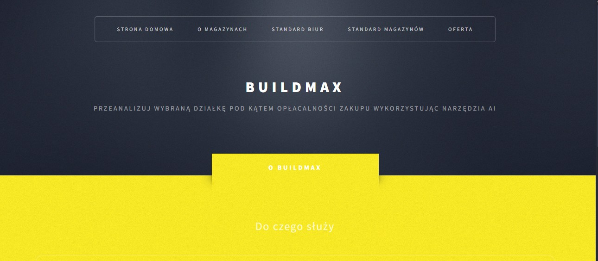

# Project Name
> BuildMax.

## Table of Contents
* [General Info](#general-information)
* [Technologies Used](#technologies-used)
* [Features](#features)
* [Screenshots](#screenshots)
* [Setup](#setup)
* [Project Status](#project-status)
* [Room for Improvement](#room-for-improvement)
* [Contact](#contact)
* [License](#license)

## General Information
- BuildMaX is an application created for warehouse developers, which analyzes selected plots for the profitability of purchase using AI tools.

## Cel aplikacji (MVP)

- Użytkownik rejestruje konto, loguje się.
- Wybiera wariant analizy (1/2/3).
- Dodaje „Zlecenie analizy” dla działki (adres/parametry, moduł magazynowy, itd.).
- System liczy „wynik analizy” (procent zabudowy, zielone, utwardzone, miejsca postojowe).
- Dla wariantu 1 generuje PDF z podsumowaniem + listą dokumentów (na MVP może być „placeholder” z linkami i wygenerowany raport tekstowy w PDF).
- Panel administracyjny: zarządzanie wariantami i przegląd zleceń.

## Technologies Used
ASP.NET Core MVC + EF Core + ASP.NET Core Identity (login and roles).

Utworzono projekt:
ASP.NET Core Web App (Model-View-Controller)
Authentication: Individual Accounts (Identity)

Pakiety: 
- Microsoft.EntityFrameworkCore.SqlServer (lub SQLite do prostoty)
- Microsoft.EntityFrameworkCore.Tools
- QuestPDF albo DinkToPdf

## Features
List the ready features here:
- Home Page 

## Screenshots

## Setup
No requirements

## Project Status
Project is: _in progress_ 

## Room for Improvement
To do:
- Add more sections

## Contact
Created by [@rockpiryt](https://www.paulinakimak.com/) - feel free to contact me!

## License -->
This project is under the [MIT License]().